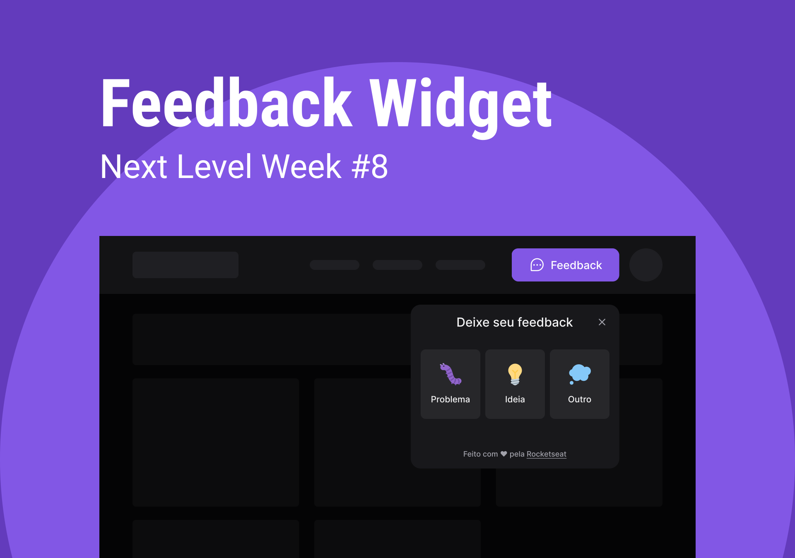
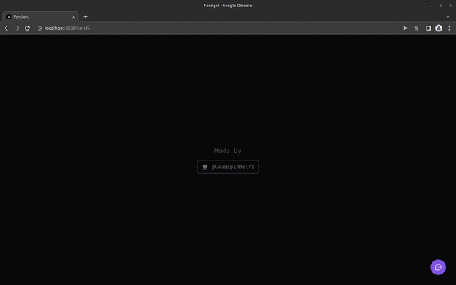

# Next Level Week - Feedget

This is the website of the main application of the Next Level Week bootcamp.

## 📄 Overview

The Feedget is a widget that collects feedbacks inside your application. The user can also take a screenshot of the page to send with the feedback.

You can see more in the [official website](https://nlw-return-i18n.vercel.app/)

### Web



[See in video format](https://res.cloudinary.com/dpkgd6rhb/video/upload/v1652063254/github/nlw-return-web-overview_jynic9.mp4)

This app collect the feedbacks from the user and send them to the API. It can also take screenshots of the site if the requested to send it with the feedback.

### I18n

The app can run in the Brazilian Portuguese (default) or in English depending to the user device language.

You can see the translation in the app with the following links:

- :brazil: [Brazil](https://nlw-return-i18n.vercel.app/pt-BR)
- :us: [English](https://nlw-return-i18n.vercel.app/en-US)

The locations files are in the `languages` folder

Lib used for i18n:

- [Next.js i18n docs](https://nextjs.org/docs/advanced-features/i18n-routing)
- [Next-intl](https://next-intl-docs.vercel.app/)

## 🏭 Technologies

### Next.js

Next.js gives you the best developer experience with all the features you need for production: hybrid static & server rendering, TypeScript support, smart bundling, route pre-fetching, and more. No config needed. (Source: Next.js)

[Official Website](https://nextjs.org/)

### HeadlessUI

Completely unstyled, fully accessible UI components, designed to integrate beautifully with Tailwind CSS. (Source: HeadlessUI)

[Official Website](https://headlessui.dev/)

### Html2canvas

Screenshots with JavaScript. (Source: Html2canvas)

[Official Website](https://html2canvas.hertzen.com/)

### Phosphor

Phosphor is a flexible icon family for interfaces, diagrams, presentations — whatever, really. (Source: Phosphor)

[Official website](https://phosphoricons.com/)

### Tailwind CSS

Rapidly build modern websites without ever leaving your HTML. (Source: Tailwind CSS)

Tailwind requires the use of the [postscss](https://postcss.org/)

## 🧪 Additional Tools

### ESLint

ESLint is a tool for identifying and reporting on patterns found in ECMAScript/JavaScript code. (Source: ESLint)

[Official website](https://github.com/eslint/eslint)

### Prettier

Prettier is a code formatter. (Source: Prettier)

[Official website](https://prettier.io)

## 💻 Usage

The official website is located in this url: https://nlw-return-i18n.vercel.app/

You can run this website in you local machine by following the [Installation](#constructionworker-installation) guide.

## :construction_worker: Installation

### Tools

You go need these tools to install this repository on your local machine:

- Git. [Install guide](https://github.com/git-guides/install-git)
- Yarn. [Install guide](https://classic.yarnpkg.com/lang/en/docs/install/#debian-stable)

After you install all these tools up head, you can proceed to the next topic.

### Cloning the Repository:

First of all, clone the repository by running the following command:

```bash
git clone https://github.com/Cauaspinheiro/nlw-return-web.git
```

After this, go to the project's folder by running the following command:

```bash
cd nlw-return-web
```

### Installing the project's dependencies

You can install the project's dependencies by running the following command inside the project's folder:

```bash
yarn
```

### `.env` - Environment variables

The dotenv file (.env) contains all the environment variables of the project. You can see the variable inside the `.env.example` file.

To configure the `.env`, you can create a new `.env` file and copy all the `.env.example` content inside this file. Then, complete the value of each key with you configuration.

#### API URL

key: `NEXT_PUBLIC_API_URL`

The API url to frontend communicate with.

This key is prefixed with `NEXT_PUBLIC_` due to [Next.js security protocols](https://nextjs.org/docs/basic-features/environment-variables#exposing-environment-variables-to-the-browser)

---

**That's it!** Now you can run the project on your local machine. See the [scripts](#scripts) section for all available scripts

## 🏃 Scripts

### build

```bash
yarn build
```

Build the project artifact for production using [Next.js CLI](https://nextjs.org/docs/api-reference/cli).

### start

```bash
yarn start
```

Run the build artifact with [Next.js CLI](https://nextjs.org/docs/api-reference/cli).

You have to run the `build` command before you run this command to work.

### dev

```bash
yarn dev
```

Start the project with hot-reloading using [Next.js CLI](https://nextjs.org/docs/api-reference/cli).

### lint

```bash
yarn lint
```

Lint the project code using [Next.js CLI](https://nextjs.org/docs/api-reference/cli).

## 🔗 Useful links

- API: https://github.com/cauaspinheiro/nlw-return-api

---

Bootcamp made with ❤️ by [Rocketseat](https://rocketseat.com.br)
